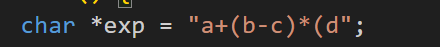
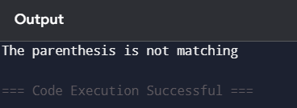
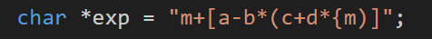
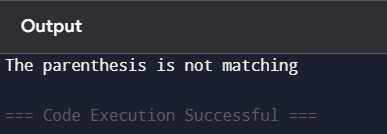
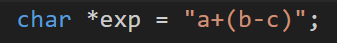

### Data Structures Defined

Stack has array implementation with the help of structure. Then it is dynamically alloted in the heap using malloc function

Code for reference: 

1) Line no 4 (For defining stack)
struct stack {
    int size;
    int top;
    char *arr;
};

2) Line no 45 (Initializing stack)
 struct stack *sp = (struct stack *)malloc(sizeof(struct stack));

### Function Implementation

Here are list of functions implemented with their purpose

1) isEmpty  
This function checks if stack if empty or not if top is equals to -1 stack is empty.

* Purpose: To check if the stack is empty or not

2) isFull  
This function checks if stack is full or not which means if top has value is one less than size then means that the stack is full.

* Purose: To check if the stack if full or not

3) push  
This function helps adding an element in stack following FILO principle (First In Last Out).It must satisfy condtion where it is not full.

* Purpose: To add an element in stack if it is not full.

4) pop  
This function helps removing an element from stack following FILO principle(First In Last Out).It must satsify conditon where it is not empty.

5) isMatching   
This function compares if poped element matches with the element which is being compared 

* Purpose: To compare popped element and element that is to be compared other wise logic won't work since [,} will also be true

6) parenthesisMatch  
This function iterates to character array provided and checks if parenthesis matches or not. It pushes in the stack if it finds any opening parenthesis and pops out if it finds any closing parenthesis There are important condition for paranthesis matching and they are :
* while popping if stack is underflow then it returns false
* after checking all characters if stack is not empty it returns false.

* Purpose: To remove an element from the stack if it not empty.

### Orgranization of main function 

In the main function to keep things simple, function parenthesisMatch is called and if it is true then parenthesis matched is printed and if flase then parenthesis does not match is printed.

## Sample Output

1) Input: 

2) Input: 

3) Input:  

