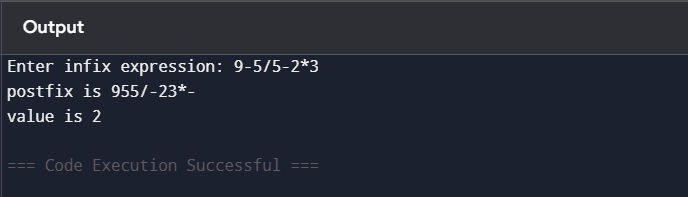
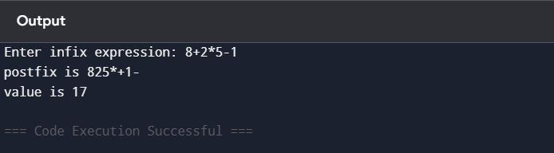
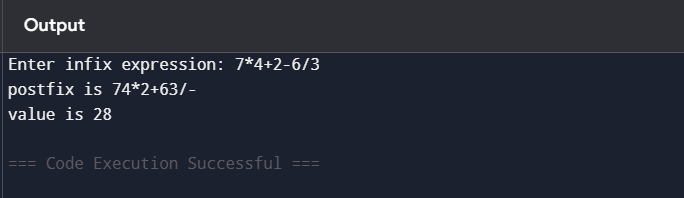

### Data Structures Defined

Stack has array implementation with the help of structure. Then it is dynamically alloted in the heap using malloc function

Code for reference: 

1) Line no 4 (For defining stack) <br>
```
struct stack {
    int size;
    int top;
    char *arr;
};
```

2) Line no 45 (Initializing stack)<br>
```
 struct stack *sp = (struct stack *)malloc(sizeof(struct stack));
 ```

### Function Implementation

Here are list of functions implemented with their purpose

1) isEmpty <br>
This function checks if stack if empty or not if top is equals to -1 stack is empty.

* Purpose: To check if the stack is empty or not

2) isFull <br>
This function checks if stack is full or not which means if top has value is one less than size then means that the stack is full.

* Purose: To check if the stack if full or not

3) push <br>
This function helps adding an element in stack following FILO principle (First In Last Out).It must satisfy condtion where it is not full.

* Purpose: To add an element in stack if it is not full.

4) pop <br>
This function helps removing an element from stack following FILO principle(First In Last Out).It must satsify conditon where it is not empty.

* Purpose: To remove top element from the stack.


5) StackTop <br>
This functions gets top element from the stack with the help of pointer.

* Purpose: To read top element from the stack.

6) inputInfix <br>
This function takes prefix expression using scanf function.

* Purpose: To take prefix expresstion from user.

6) isOperator <br>
This function checks if the character is anoperator or not by using simple if else.

* Purpose: To check if the character is an operator or not.

7) precedence <br>
It uses if and else if to return an integer to anticipate precedence of an character it returns 3 for * and / and 2 for + and - and 0 for everything else.

* Purpose: To determine precedence for the operator.

8) infixToPostfix <br>
It scans infix string from left to right.It copies operads directly from infix to posfix but when it encounters operator then it compares precedence with the operator at the top of the stack. If it has higher precedence then it pushes to postfix stack otherwise popped and added later when condition is met. After the scan is complete remaining operator are popped and pushed into stack.

* Purpose: To convert Prefix To Postfix Expression

9) evaluatePostfix <br>
It pushes operands into the stack and whenever operator is found it pops out two values from stack and perfoms the operation and pushes back the result.

* Purpose: To evaluate the found postfix expression.

### Orgranization of main function 

In main function simply input is taken by calling inputInfix function. After which postfix expression is found with the help of function infixToPostfix function and printed.Then it is evaluated using evaluatePostfix function and printed as well.

## Sample Output

1) Input 1:<br>


2) Input 2: <br>


3) Input 3: <br>
