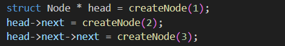
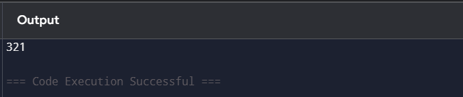

### Data Structures Defined

Linked List is defined by defining a node as strucutre with data and a pointer to next node.

Code for reference: 

1) Line no 4 (For linked list)
struct Node{
    int data;
    struct Node* next;
};

### Function Implementation

Here are list of functions implemented with their purpose

1) createNode  
createNode function returns a pointer to node which is newly created with the help of dynamic memory allocation.

* Purpose: To create a new node.

2) reverseTraverse  
It uses recuurtion to traverse through a linked list and printing it. To print each element in reverse manner it must be traversed first thats why this idea works.

* Purose: To reverse traverse through a linked list.

### Orgranization of main function 
In main function new nodes are created and data is given to them also next node is connected to previous one with the help of pointers. In the end reverseTraverse function is called which prints linked list in reverse manner.

## Sample Output

1) Input: 

