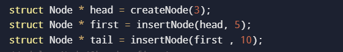
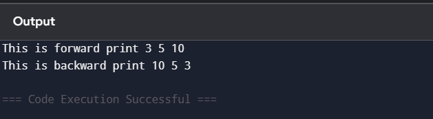
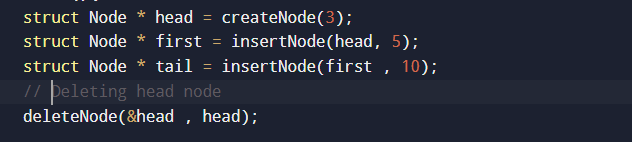
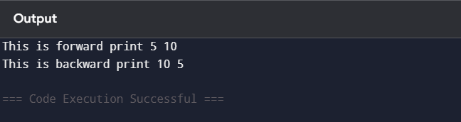
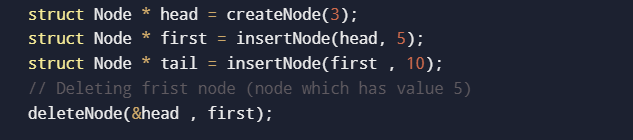

## Data Structures Defined

Linked List is defined by defining a node as strucutre with data and a pointer to next node.

Code for reference: 

1) Line no 4 (For linked list) <br>
```
struct Node{
    int data;
    struct Node* next;
    struct Node* previous;
};
```
## Function Implementation

Here are list of functions implemented with their purpose

1) <b>createNode</b> <br>
createNode function returns a pointer to node which is newly created with the help of dynamic memory allocation.

* Purpose: To create a new node.

2) <b>insertNode</b> <br>
insertNode function takes previous node and connects its next pointer to current node which is being inserted and connects current node's previous pointer to previous node and current node's next pointer to previous node's next pointer and in the end it connects next nodes previous pointer to current node which is being inserted.

* Purose: To insert a node in a doubly linked list.

3) <b>deleteNode</b> <br>
deleteNode takes two nodes as parameter one is head node (original) and the other one is node to be deleted. If the node to be deleted is not head node then previous nodes next pointer is connected with next node and next node's previous pointer is connected with previous node in the end memory is made free.

* Purpose: To delete a node from doubly linked list.

4) <b>printForward</b> <br>
It uses while loop to ensure that until head node is null it prints every element in forward manner by printing next nodes data.

* Purpose: To print linked list in forward manner.

5) <b>printBackward</b> <br>
It uses while loop to print linked list in backward manner by passing previous node from tail till it's null.

* Purpose: To print linked list in backward manner.

## Orgranization of main function 
In main function new nodes are created and data is given to them also next node is connected to previous one with the help of pointers. In the end reverseTraverse function is called which prints linked list in reverse manner.


## Sample Output

1) <b>Inserting data 5 in between head and tail</b><br>




2) <b>Deleting head node.</b> <br>




3) <b>Deleting node 5 which was inserted.</b> <br>



