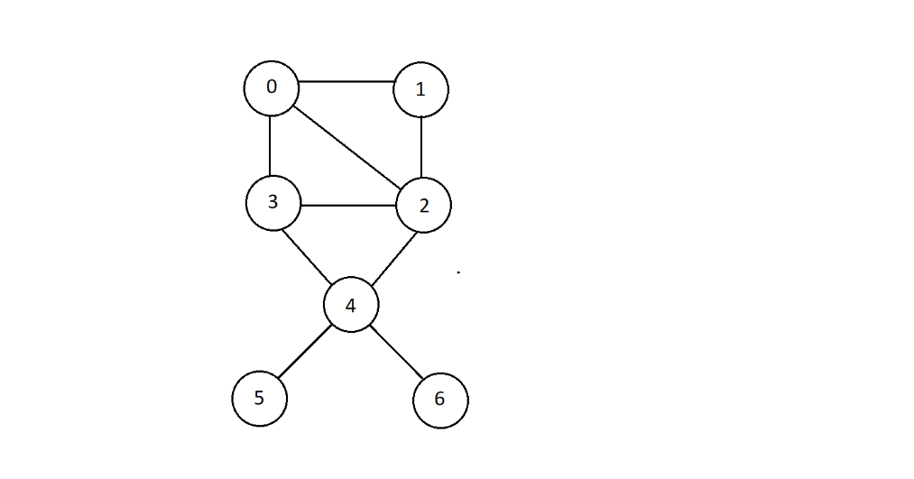
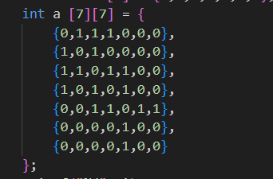
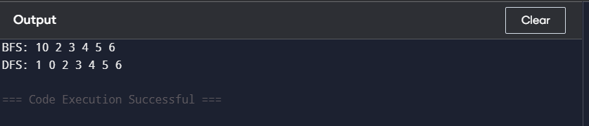

## Representation of graph as adjancey matrix


Can be represented as:<br>


## Data Structures Defined

Queue has array implementation and is defined as strucutre with size , front index, rear index, and an array.

Code for reference: 

1) Line no 4 (Defining Queue) <br>
```
struct queue
{
    int size;
    int f;
    int r;
    int* arr;
}; 
```
## Function Implementation

Here are list of functions implemented with their purpose

1) isEmpty <br>
If rear = front condtion is satisfied then the queue is empty

* Purpose: To check if the queue is empty or not.

2) isFull <br>
isFull returns one if rear is equals to size - 1 which indicates that the queue is full.

* Purose: To check if the queue is full or not.

3) enqueue <br>
enqueue inserts element to queue if it is not full.

* Purpose: To insert an element in queue.

4) dequeue <br>
If the queue is not empty it increases front index by one removes value in front.

* Purpose: To remove an element in queue..

5) BFS <br>
Function BFS implements BFS algoritim where it adds a certain vertex to exploration queue and then mark it as visited and pick another vising node and then add it's neighbours in exploration queue and so on until every vertex is visited / printed.

* Purpose: To travese the graph using BFS algorithm

5) DFS <br>
DFS uses function recurssion which is in memory a stack and implements traversal of graph.

* Purpose: To traverse the graph using DFS algorithm.

## Orgranization of main function 
Queue is initialized in main function by assigning it's front and rear both zero and giving it size and also allocating it dynamically using malloc function and also both the function DFS and BFS are called in main function.


## Sample Output

1) BFS and DFS of graph above taking 1 as a root node.<br>



