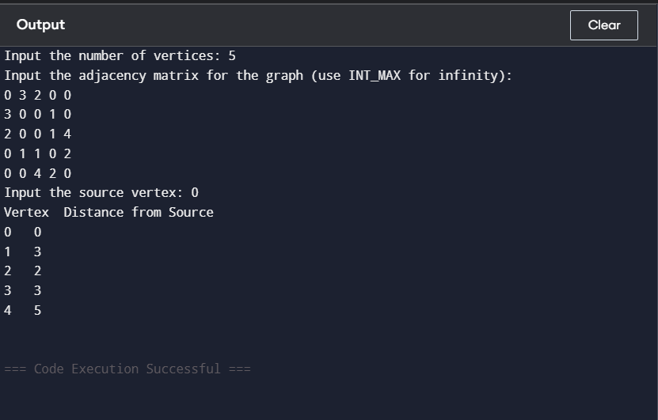

## Data Structures Defined

Graph has adjacency matrix implementation and is defined using a fixed maximum size along with helper arrays for distance and visited status.

## Function Implementation

Here are list of functions implemented with their purpose

1) <b>minDistance</b>  

Scans the distance array and finds the vertex with the minimum distance value that is not yet marked as processed in the shortest path tree set.

Purpose: To select the next closest unprocessed vertex.

2) <b>printSolution</b>

Prints the final distance array in table form showing each vertex and its shortest distance from the source.

Purpose: To display shortest path results.

3) <b>dijkstra</b>

Implements Dijkstra’s shortest path algorithm using adjacency matrix. Initializes distances to infinity and visited set to false. Repeatedly selects the nearest unvisited vertex, marks it processed, and relaxes all adjacent edges if a shorter path is found.

Purpose: To compute shortest path distances from source to all vertices.

## Orgranization of main function 
First number of vertices is taken and then graph is taken in adjacency matrix form and then after that intial node is taken and then dijsktras function is called which implements dijkstras algorithm.

## Sample Output

1) Implementation of dijkters algorithm  
  

