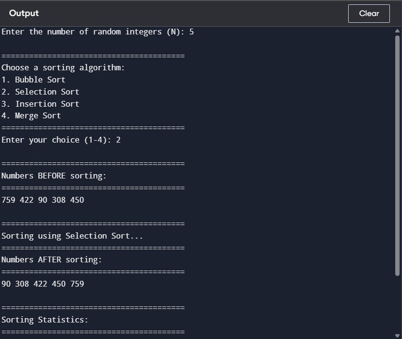
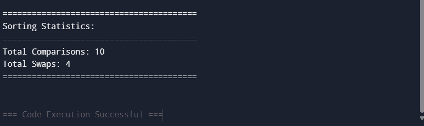

## Data Structures Defined

Dynamic integer arrays are used to store randomly generated numbers and their copy for before/after comparison. Global counters are used to track performance statistics.

Code for reference:

1) Global Counters (Comparisons and Swaps) <br>
```c
long long comparisons = 0;
long long swaps = 0;
```

2) Dynamic Arrays in main <br>
```c
int *arr = (int *)malloc(n * sizeof(int));
int *original = (int *)malloc(n * sizeof(int));
```

- arr[] stores numbers to be sorted  
- original[] stores original unsorted numbers  
- comparisons counts total comparisons  
- swaps counts total swaps or shifts  

---

## Function Implementation
Here are list of functions implemented with their purpose


1) <b>swap</b> <br>
Swaps two integer values using pointers and increments the swap counter.

Purpose: To exchange two elements and track swap operations.


 2) <b>printArray </b><br>
Prints all elements of the array and formats output with 20 numbers per line for readability.

Purpose: To display array contents.


 3) <b>generateRandomNumbers</b> <br>
Generates random integers between 1 and 1000 and stores them in the array.

Purpose: To create input data for sorting.


4) <b>bubbleSort</b> <br>
Compares adjacent elements repeatedly and swaps them if they are in the wrong order. Each pass places the largest remaining element at the end.

Purpose: To sort array using Bubble Sort while counting comparisons and swaps.


 5) <b>selectionSort</b> <br>
Selects the minimum element from the unsorted part and swaps it with the current index position.

Purpose: To sort array using Selection Sort while counting comparisons and swaps.


 6) <b>insertionSort</b> <br>
Builds a sorted section step by step by shifting larger elements right and inserting the key in correct place.

Purpose: To sort array using Insertion Sort while counting comparisons and shifts.


7) <b>merge </b> <br>
Creates temporary left and right arrays, compares elements, and merges them back in sorted order.

Purpose: To merge two sorted subarrays.


8) <b> mergeSort </b> <br>
Recursively divides the array into halves, sorts each half, and merges them.

Purpose: To sort array using Merge Sort (divide and conquer).

## Organization of main function
First random integers are generated and it is being copied to display. Then we ask user to choose sorting algorithm using switch case and according algorithm is choosen after that before and after array is printed and comparisons and swaps are also printed and allocated memory is freed.

## Sample Output
1) Sample output of selection sort out of all sorting algorithms <br>
 <br>
 <br>

